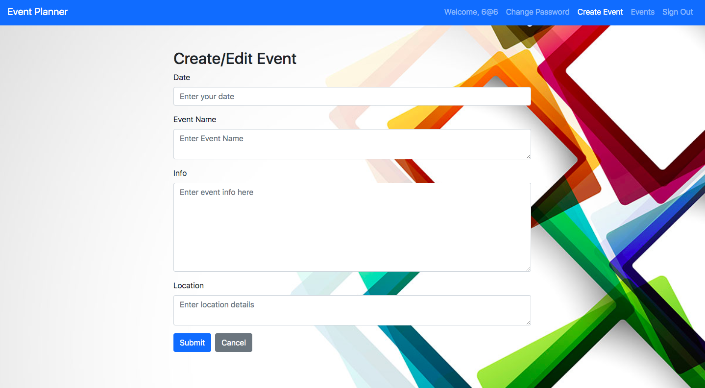
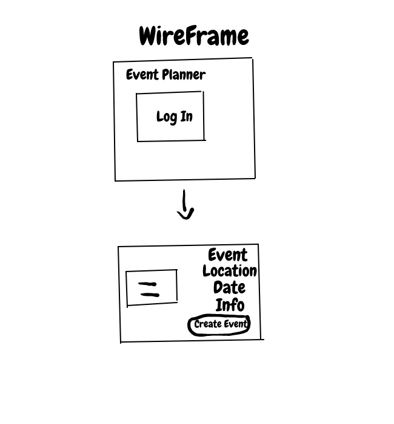

# Event Planner

The Event Planner is a front end application built using React where signed in users are able to create, edit, and delete events to their planner.

## Planning Process
  My first approach on creating the application consisted of creating the ERD and the Wireframe to have a visualization of the functionalities of the application. From there, I started to work on the API and tested the CRUD actions with curl scripts. While working on the React front end of the application, I started with creating the CRUD actions which would enable the user to create, edit, delete, and view all event(s). Once I finished the CRUD actions, I started creating on the event form that would render the functionalities of the app.

  ## User Stories
   - As a user, I want to be able to sign-up
   - As a user, I want to be able to sign-in
   - As a user, I want to be able to change password
   - As a user, I want to be able to sign-out
   - As a user, I would like success/failure messages when I have completed an auth action.
   - As a user, I would like to create an event
   - As a  user, I would like to view all events
   - As a user, I would like to edit an event
   - As a user, I would like to delete an event

## Technologies
  - JavaScript
  - CSS
  - HTML
  - React
  - Github
  - Git

## Setup
  1. Fork and clone this repository.
  2. Install dependencies using `npm install`.
  3. Git add and git commit your initial changes.
  4. View changes by running local server `npm run start`.

## Links
- Deployed Front-End Client: https://ajamcato.github.io/capstone-client/
- Front-End Client Repository: https://github.com/ajamcato/capstone-client
- Deployed Back-End API: https://morning-reef-49097.herokuapp.com/
- Back-End API repository: https://github.com/ajamcato/capstone-api

